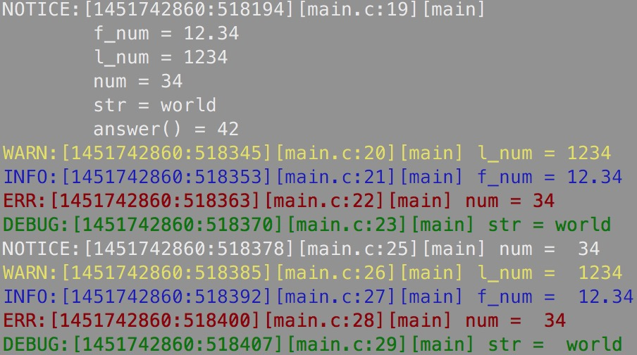

# dsd_debug
c语言调试宏
## 代码示例
```c
int main(int argc, char const *argv[]) {
	int num = 34;

	dsd_set_log_level(DSD_ERR|DSD_NOTICE|DSD_WARN|DSD_DEBUG|DSD_INFO);

	dsdl_notice("this is a test\n");
	dsdl_notice("num = %d\n", num);
	dsdl_info("this is a test\n");
	dsdl_info("num = %d\n", num);
	dsdl_debug("this is a test\n");
	dsdl_debug("num = %d\n", num);
	dsdl_warn("this is a test\n");
	dsdl_warn("num = %d\n", num);
	dsdl_err("this is a test\n");
	dsdl_err("num = %d\n", num);

	return 0;
}
```
## 输出内容

