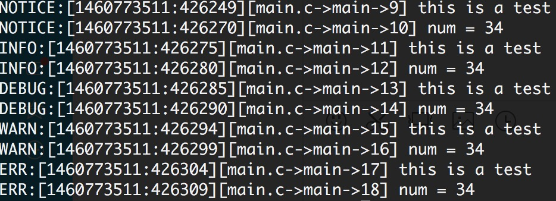

# dsd_debug
c语言调试宏
## 代码示例
```c
int main(int argc, char const *argv[]) {
	int num = 34;
	unsigned long long l_num = 1234;
	char *str = "world";
	float f_num = 12.34;

	dsd_set_log_level(DSD_ERR|DSD_NOTICE|DSD_WARN|DSD_DEBUG|DSD_INFO);//set debug level

	dsdl_notice(f_num, l_num, num, str, answer());
	dsdl_warn(l_num);
	dsdl_info(f_num);
	dsdl_err(num);
	dsdl_debug(str);

	dsdl_notice_raw("num = ", num);
	dsdl_warn_raw("l_num = ", l_num);
	dsdl_info_raw("f_num = ", f_num);
	dsdl_err_raw("num = ", num);
	dsdl_debug_raw("str = ", str);

	return 0;
}
```
## 输出内容

## 使用方法
```
#define _DEBUG
#include "debug.h"
//开始享受调试的乐趣吧 
```
